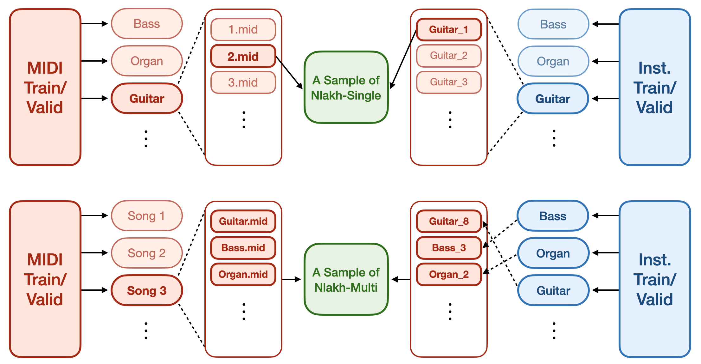

# Nlakh

## Description

- Nlakh consists of *Nlakh-single* that contains single-track audio and *Nlakh-multi* that contains mixture audio with separate tracks (stem) of each instrument.

- The process of rendering a sample of Nlakh-single and Nlakh-multi is illustrated as below, and more details are in our paper.




- Some statistics of Nlakh dataset

| Dataset | Size (Hours) | Number of Samples | Number of Instruments |
|------|------|------|------|
| Nlakh-single (train) | 1,397 | 953,000 | 953 | 
| Nlakh-single (valid) | ??? | 53,000 | 53 |
| Nlakh-multi (train) | 153 | 100,000 | 953 |
| Nlakh-multi (valid) | ??? | 10,000 | 53 |


## Set up dataset
- Nlakh can be downloaded at:
    - [download Nlakh-single](https://drive.google.com/file/d/14Uav5LlZWvmqYEJenz4xDQMC7kjbszPC/view?usp=share_link)
    - [download Nlakh-multi](https://drive.google.com/file/d/1MZBqvampGCkjZpCTMOXY517ymo0laiBc/view?usp=share_link)
- The folder is structured as follows
```
 Nlakh-single
  ├── train
  │  │── 001
  │      │── 0001.wav 
  │           ...
  │      │── 1000.wav
  │       ...
  │  │── 953
  ├── valid
  
  
 Nlakh-multi
  ├── train
  │  │── 000001
  │      │── 124.wav 
  │          ...
  │      │── 943.wav
  │      │── mix.wav
  │       ...
  │  │── 100000
  ├── valid
  
  ```
